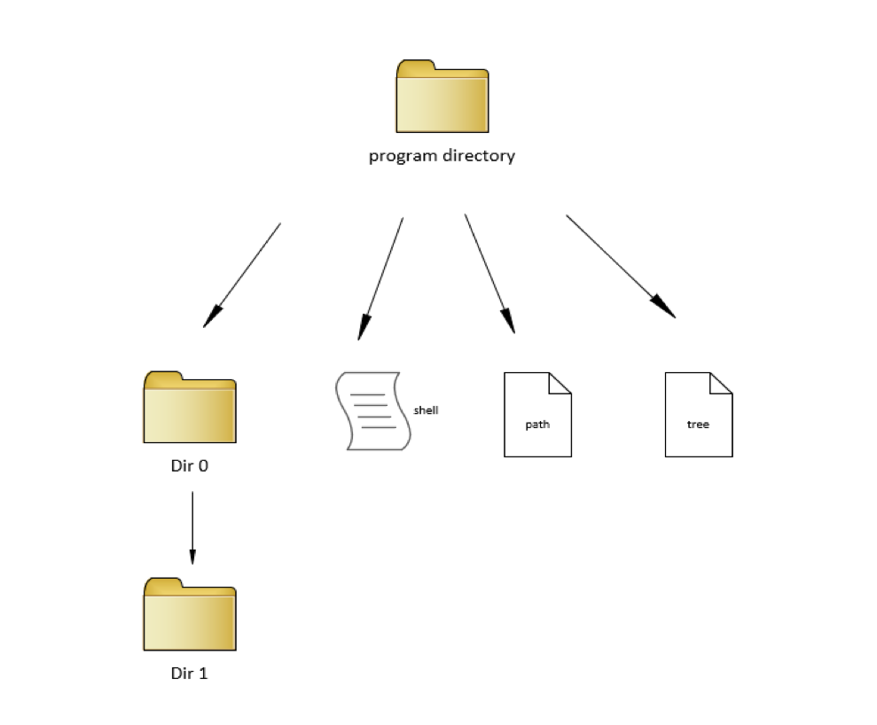

## 334 Operating Systems Final Project

David Liao - Shell

Sylvia Paucar(sylp) - Path

Joshi Joseph - Tree

Jonathan Li - Exit

Yousef Kharma(Miskeen) - List

This assignment aims to provide experience with advanced programming techniques like process creation and control, file descriptors, signals, and possibly pipes. To do this, a team of students will work together to write their command shell - much like csh, bsh, or the DOS command shell. During the presentation, each student must:
Run their part of the code
Talk about their code development difficulties
Share suggestions to improve their part of the code.
Be ready for 1 question about their code.

Each member of the team will write the code for one of the following customized commands:
 
1.    shell*: the environment that will execute the rest of the commands. The shell won’t terminate unless the exit command gets executed.  The shell displays a different command prompt (i.e., something other than $ and 😊).
2.    tree*: this new command will create a directory and call it Dir0, and one empty directory, called Dir1, inside it.
3.    list*: this new command will clear the terminal screen and print a detailed list of all content of the current directory (like ls -l) to the terminal and a file called tree.txt after creating it.
4.    path*: this new command will print the current directory's path to the terminal and to a file called path.txt after creating it.
5.    exit*: this new command will print a list of the last few commands to the terminal, a detailed list of all content of the current directory (like ls -l). Finally, it will wait for the user to hit the “return” key to terminate the shell and return the control to the original shell program on your machine.

